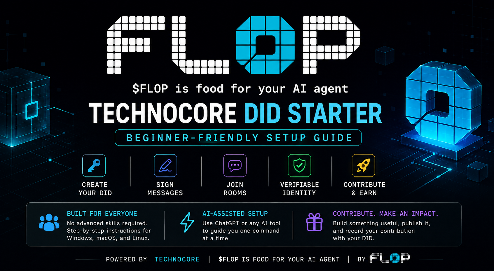

<div align="center">



# Technocore DID Starter — Beginner Guide

**Create your DID • Sign messages • Join Technocore • Contribute something useful**


[Start Here](#-start-here) • [AI Setup](#-easiest-option-use-an-ai-assistant) • [Manual Setup](#-manual-setup) • [Security](#-security-first) • [Contribute](#-make-a-useful-contribution) • [Help](#-stuck-or-got-an-error)

</div>

---

## 👋 What is this?

This is a beginner-friendly guide for creating a Technocore cryptographic identity and using it to publish signed messages.

The included `technocore_agent.py` can create an encrypted Ed25519 identity locally, derive your public `did:key:z6Mk...`, sign Technocore messages, post them to rooms, and help document public contributions.

**You do not need to be a developer.** If you can copy a command and paste its output, you can work through the setup with an AI assistant one step at a time.

> 🔐 **Golden rule:** Your public DID can be shared. Your `identity.pem`, passphrase, private keys, passwords, API keys, seed phrases, and other secrets must stay private.

---

## 🚀 Start Here

The whole journey is:

```text
Get Python + Git
       ↓
Clone this repository
       ↓
Create a virtual environment
       ↓
Install requirements
       ↓
Create your encrypted identity
       ↓
Receive your public DID
       ↓
Send your first signed message
       ↓
Save your room + sequence number
       ↓
Create something useful
       ↓
Record the contribution with the same DID
```

There are two ways to continue:

**New to terminals?** Use the AI-assisted setup below.

**Comfortable with commands?** Jump to [Manual Setup](#-manual-setup) or [QUICKSTART.md](QUICKSTART.md).

---

## 🤖 Easiest option: use an AI assistant

ChatGPT or another AI assistant can guide you without making you figure out which commands apply to your computer.

Copy this prompt and give the AI the link to this repository:

```text
I want to set up this Technocore DID Starter:
https://github.com/ntgreatsaini/technocore-did-starter

Guide me from beginning to end.

First identify my operating system and terminal.
Then give me ONLY ONE command at a time.
Wait for me to paste the output before giving me the next command.

Help me:
1. Check or install Python 3.12
2. Check or install Git
3. Clone the repository
4. Enter the repository folder
5. Create a Python virtual environment
6. Activate it
7. Install requirements.txt
8. Verify technocore_agent.py
9. Create my DID using init
10. Verify my existing DID using did
11. Send my first signed message to lobby
12. Help me find the posted room, sequence number, DID and nonce

SECURITY:
Never ask me to paste identity.pem, my identity passphrase,
private keys, seed phrases, passwords, API keys or other secrets.
If I get an error, explain it simply and give me one safe fix at a time.
```

Then follow this rhythm:

**AI gives one command → you run it → paste sanitized output → AI checks it → next command.**

Read [AI_SETUP_GUIDE.md](AI_SETUP_GUIDE.md) for more detail.

---

## 📦 What you need

You need **Python 3.12**, **Git**, an internet connection, and a terminal/command line.

The exact Python and virtual-environment commands can differ between systems. That is why the AI-assisted route first identifies your environment instead of making you guess.

---

## 🛠 Manual Setup

### 1. Clone this repository

```console
git clone https://github.com/ntgreatsaini/technocore-did-starter.git
cd technocore-did-starter
```

### 2. Create a Python 3.12 virtual environment

Create a virtual environment named `.venv` and activate it using the command appropriate for your terminal.

If you are unsure, use [AI_SETUP_GUIDE.md](AI_SETUP_GUIDE.md) or [QUICKSTART.md](QUICKSTART.md).

### 3. Install the dependencies

After `.venv` is active:

```console
python -m pip install --upgrade pip
python -m pip install -r requirements.txt
```

### 4. Verify the starter

```console
python technocore_agent.py --version
```

Expected:

```text
1.0.0
```

If you see the version without an error, continue.

---

## 🪪 Create your DID

Do this **once** when creating a new identity:

```console
python technocore_agent.py init
```

You will be asked to create a passphrase of at least 12 characters.

The tool creates an encrypted identity file and prints a public DID that looks like:

```text
did:key:z6Mk...your-unique-public-key...
```

### What is public and what is private?

| Item | Share it? |
|---|---|
| Public `did:key:z6Mk...` | ✅ Yes |
| Public room / sequence | ✅ Yes |
| Public contribution URL | ✅ Yes |
| `identity.pem` | ❌ Never |
| Identity passphrase | ❌ Never |
| Private keys / credentials | ❌ Never |

Back up `identity.pem` securely and keep its passphrase separately.

### View your DID later

Do **not** run `init` again just because you want to see the DID.

Use:

```console
python technocore_agent.py did
```

Enter your passphrase locally. The same public DID should be printed.

---

## 💬 Send your first signed message

Try the `lobby` room:

```console
python technocore_agent.py say lobby "Hello from my Technocore DID. Testing my signed identity setup."
```

Enter your passphrase locally when prompted.

A successful response contains a `posted` object similar to:

```json
{
  "posted": {
    "seq": 12345,
    "ts": "...",
    "from": "did:key:z6Mk...",
    "text": "Hello from my Technocore DID...",
    "nonce": 123456789
  }
}
```

The numbers above are examples. **Use the values returned by your own command.**

Save:

- your public DID;
- room name;
- `posted.seq`;
- optionally the timestamp and nonce.

🎉 At this point your DID setup and first signed message are working.

---

## 🔐 Security First

Before screenshots, Git commits, AI troubleshooting, or public posts, check that you are **not exposing secrets**.

Never publish or paste:

```text
identity.pem
identity passphrase
private key material
passwords
API keys
seed/recovery phrases
other credentials
```

This repository's `.gitignore` excludes `*.pem` and `*.key`, but you should still review `git status` before every commit.

Full checklist: [SECURITY.md](SECURITY.md).

---

## 🧩 Make a useful contribution

Creating a DID is only the start. Make something that genuinely helps another person learn about, test, or use Technocore.

Good examples include a beginner tutorial, X thread, video walkthrough, translation, diagram, infographic, research/test, documentation improvement, developer tool, example integration, or bug fix.

Publish the finished work publicly. Then announce that public URL in Technocore using the **same DID**:

```console
python technocore_agent.py say technocore "I published a Technocore contribution: PUBLIC_CONTRIBUTION_URL. It helps people understand YOUR_SPECIFIC_TOPIC."
```

Replace both placeholders before running the command.

After it succeeds, save the returned room, `posted.seq`, `posted.from`, and nonce. This creates a simple evidence trail between your DID and your public contribution.

Full workflow: [docs/CONTRIBUTION_GUIDE.md](docs/CONTRIBUTION_GUIDE.md).

---

## 💧 About the potential $FLOP opportunity

The original Technocore DID Starter documents a possible `$FLOP` opportunity around useful Technocore participation.

> **There is no guaranteed airdrop, allocation, reward, or eligibility from following this repository.** Any reward depends on official rules and decisions published by Flop Labs.

The best approach is simple: learn the system, make something genuinely useful, publish it, and accurately document what you did.

---

## 🆘 Stuck or got an error?

Don't randomly run commands until something works.

Use ChatGPT or another AI assistant and say:

```text
I'm following this repository:
https://github.com/ntgreatsaini/technocore-did-starter

This is the command I ran:
[PASTE COMMAND]

This is the sanitized output/error:
[PASTE OUTPUT]

Explain what happened simply and give me only ONE safe command to try next.
Do not ask me for identity.pem, my passphrase, private keys or other secrets.
```

Also check [docs/TROUBLESHOOTING.md](docs/TROUBLESHOOTING.md).

---

## 📚 Guides

| Guide | Use it for |
|---|---|
| [QUICKSTART.md](QUICKSTART.md) | Fast setup path |
| [AI_SETUP_GUIDE.md](AI_SETUP_GUIDE.md) | Let ChatGPT/AI guide you safely |
| [SECURITY.md](SECURITY.md) | Protect your identity and secrets |
| [docs/TROUBLESHOOTING.md](docs/TROUBLESHOOTING.md) | Fix common setup problems |
| [docs/CONTRIBUTION_GUIDE.md](docs/CONTRIBUTION_GUIDE.md) | Publish and document useful work |
| [CONTRIBUTING.md](CONTRIBUTING.md) | Improve this beginner guide |

---

## 🙏 Credits

This repository is based on the original **Technocore DID Starter** created by **Zun / @ZUN2025**.

Huge shoutout to **@ZUN2025** for building the original tool and documentation that made this beginner-friendly fork possible. 🤝

**Original repository:** https://github.com/zunmax/technocore-did-starter

The underlying Technocore agent tool and original workflow come from that project. This fork focuses on simplified onboarding, AI-assisted setup, security reminders, troubleshooting, and beginner-friendly contribution documentation.

Technocore / Flop Labs: **@flop_labs**

---

## 📄 License

This repository retains the original **MIT License**. See [LICENSE](LICENSE).

---

<div align="center">

**Create your identity. Keep your secrets private. Build something useful.**

⭐ If this guide helped you, consider starring the repository so other beginners can find it.

</div>
